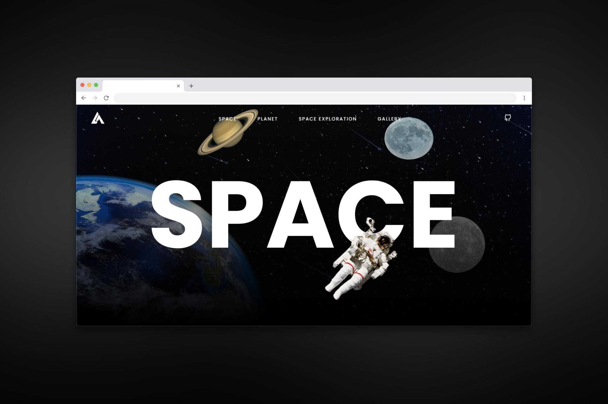

<h1 align="center">
    <b>SPACE</b> 
</h1> 

SPACE is an online educational website about space. This website contains information about space, NASA, and planets, accompanied by original images captured directly by NASA. In addition, this website also features quizzes to test your understanding of space.
 

<h3 align='center'>
Step Into The Experience</h3>

  <a href="https://ryuz-v.github.io/Space/" target="_blank" style="padding: 12px 20px; background: #343434ff; color: white; border-radius: 10px; text-decoration: none; font-weight: bold; display: inline-block;">
    Deploy Now
  </a>

